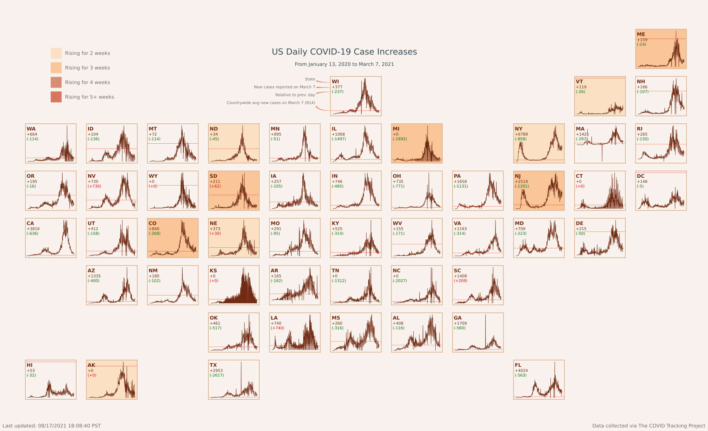

# Visualizing daily cases of COVID-19 in the United States

In this notebook we will create a graphic of the 50 states (plus D.C.), each containing a chart displaying the daily case count over time for that state.

Click :point_right: [here](https://blakejarvis.design/assets/img/output_40_1.svg) to view the final map result in a new tab or scroll to the [bottom](#displaying-the-plot).


```python
import csv
import requests
import numpy as np
import pandas as pd
from io import StringIO
import matplotlib.pyplot as plt
import matplotlib.gridspec as gridspec
from datetime import datetime
import matplotlib.lines as mlines
import matplotlib.offsetbox as offsetbox
import formatting as form

plt.close('all')
```

First we download the raw data from [The COVID Tracking Project](https://covidtracking.com)


```python
CSV_URL = 'https://covidtracking.com/api/v1/states/daily.csv'

with requests.Session() as s:
    download = s.get(CSV_URL)
    decoded_content = download.content.decode('utf-8')
    cr = pd.read_csv(StringIO(decoded_content))
    df = pd.DataFrame(cr)
```

Next, convert date integers to DateTime format


```python
date = pd.to_datetime(df['date'].astype(str), format='%Y%m%d')
dataType = 'positiveIncrease'
df = pd.DataFrame({'date':date, 'state':df['state'], dataType:df[dataType]})
df.groupby('date')
```


    <pandas.core.groupby.generic.DataFrameGroupBy object at 0x00000186CD9DA9D0>


List containing every state abbreviation (includes DC)


```python
stateNames = ['WA', 'ID', 'MT', 'ND', 'MN','WI','MI','NY','VT', 'NH','ME',
             'OR','WY', 'SD', 'IA', 'IL', 'IN', 'OH', 'PA', 'MA', 'RI', 'CT', 'NJ',
             'DE', 'MD', 'DC', 'CA', 'NV', 'UT', 'CO', 'NE', 'MO', 'KS', 'OK', 'NM', 
              'AZ', 'TX', 'LA', 'AR', 'TN', 'MS', 'AL', 'KY', 'WV', 'VA', 'NC',
             'SC', 'GA', 'FL', 'AK', 'HI']
```

Create a new DataFrame with each state as a column and their positiveIncreases as rows, indexed by date.

*I'm sure there's a cleaner way to do this...*


```python
dfstates = []

for name in stateNames:
    sel = df[(df['state']==name)]
    sel.index=sel['date']
    dfstates.insert(len(dfstates), sel)
dfgroup = pd.DataFrame()

for d in dfstates:
    dfgroup[d['state'][0]] = d[dataType]
```

Compare weekly totals to the previous week for 7 weeks. Returns how many consecutive weeks saw a relative increase to the previous week.


```python
def consecutiveWeeksIncreased(state):
    weeks = 0
    prev = 999999
    for week in range(7):
        thisWeekSum = sumRange(state, weeks * 7, weeks * 7 + 8)
        if thisWeekSum <= prev:
            prev = thisWeekSum
            weeks += 1
        else:
            return weeks
    return weeks - 1
```

Get the average number of new cases for all states


```python
avgIncrease = 0
for state in dfgroup:
    avgIncrease += dfgroup[state][0]
avgIncrease /= dfgroup.shape[1]
avgIncrease = int(avgIncrease)
avgIncrease
```


    814


Create a subplot for the state by state abbreviation


```python
def do_plot(ax, name):
    
    #Get color pair based on how many weeks the state has seen an increase in total cases
    weeksClimbing = consecutiveWeeksIncreased(dfgroup[name])
    colors = form.getContrastingColors(weeksClimbing)
    faceColor = colors[0]
    infoColor = colors[1]
    
    #Set the face color
    ax.set_facecolor(faceColor)
    
    #plot the data for this state
    ax.plot(dfgroup[name], color=(infoColor), linewidth=1)
    
    #remove the labels, grids & ticks for a cleaner look
    ax.set_xlabel('')
    ax.grid(False)
    ax.set_xticklabels('')
    ax.set_yticklabels('')
    
    #Display the state abbreviation title
    ax.set_title(name,horizontalalignment='left', color=(infoColor), fontweight="bold", fontsize=14, x=0.025, y=.775)
    
    #Display a subtle border
    form.formatBorder(ax)
    
    #Display a '100 new cases' threshold for scale
    ax.axhline(y=avgIncrease, color='r', linestyle='-', linewidth=.5)

    #Latest increase    
    lastChange = form.getLastIncreaseChange(name, dfgroup)
    changeNote = '(' + form.getIncreaseSign(lastChange) + str(lastChange) + ')'
    box = dict(boxstyle='round,pad=0.1', fc=faceColor, ec=faceColor, alpha=0.7)
    ax.annotate(s= '+'+str(int(dfgroup[name][0])), xy=(.025, 0.7), xycoords='axes fraction', fontsize=11, color=infoColor, bbox = box)
    
    #Latest increase vs previous day
    ax.annotate(s= changeNote, xy=(.025, 0.581), xycoords='axes fraction', fontsize=11, color=form.getIncreaseColor(lastChange), bbox = box)
```

Get the sum of contents within a list's range


```python
def sumRange(L,a,b):                                                                                                                                                                                                
    sum = 0                                                                                                                                                                                                         
    for i in range(a,b+1,1):                                                                                                                                                                                        
        sum += L[i]                                                                                                                                                                                                  
    return sum      
```


```python
def invLerp(a, b, t):
    return (float(t)-float(a)) / (float(b)-float(a))
```

Add a state to the grid by abbreviation


```python
def add_state(figure, stateName, grid):
    state = figure.add_subplot(grid)
    do_plot(state, stateName)
    return state
```

Create a "Last updated on ___" string to use in the plot


```python
now = datetime.now()
dt_string = now.strftime("%m/%d/%Y %H:%M:%S")
dt_string = "Last updated: " + dt_string + " PST"
```

Create a string to describe the range of time on the plot


```python
lastDate = date[0]
lastYear = lastDate.year
lastDate = lastDate = lastDate.month_name() + ' ' + str(lastDate.day)
shape = date.shape
firstDate = date[shape[0]-1]
firstYear = firstDate.year
firstDate = firstDate.month_name() + ' ' + str(firstDate.day)
dateRangeString = 'From ' + firstDate + ', ' + str(firstYear) + ' to ' + lastDate + ', ' + str(lastYear) 
```

Add groups of states in vertical columns using a list of abbreviation strings


```python
def add_column(fig, names, column, grid):
    row = 0
    for name in names:
        if(name == ""):
            row+=1
            continue
        else:
            add_state(fig, name, grid[row, column])
            row+=1
```

## Creating the Plot

Create the plot and a grid to fit each state into.


```python
plt.style.use('fivethirtyeight')

g = gridspec.GridSpec(11, 11)

fig = plt.figure(figsize=(30,25), facecolor=form.light)
```


    <Figure size 2160x1800 with 0 Axes>


### Create the Plot Title


```python
fig.suptitle('US Daily COVID-19 Case Increases', y=0.85, fontsize=24, color=form.titleColor)
fig.text(.5, .822, s=dateRangeString, color = form.titleColor, horizontalAlignment = 'center')
```

    <ipython-input-52-db0fcf42275a>:2: MatplotlibDeprecationWarning: Case-insensitive properties were deprecated in 3.3 and support will be removed two minor releases later
      fig.text(.5, .822, s=dateRangeString, color = form.titleColor, horizontalAlignment = 'center')
    


    Text(0.5, 0.822, 'From January 13, 2020 to March 7, 2021')


Add the "Last updated on ___" label to the plot


```python
fig.text(x=.05, y=.25, s = dt_string, color=form.labelColor)
x = .1
y =.75
```

### Creating the legend


```python
twoWeeksIncrease = mlines.Line2D([],[], color = form.medLight, marker='s',markersize=30, label='Rising for 2 weeks')
threeWeeksIncrease = mlines.Line2D([],[], color = form.medium, marker='s',markersize=30, label='Rising for 3 weeks')
fourWeeksIncrease = mlines.Line2D([],[], color = form.medDark, marker='s',markersize=30, label='Rising for 4 weeks')
fiveWeeksIncrease = mlines.Line2D([],[],  color = form.medDark2, marker='s',markersize=30, label='Rising for 5+ weeks')
legend = fig.legend(handles=[twoWeeksIncrease, threeWeeksIncrease, fourWeeksIncrease, fiveWeeksIncrease], loc='upper left',borderaxespad=10, framealpha=0, labelspacing=2)
```

Set the color for each legend


```python
for t in legend.get_texts():
    t.set_color(form.labelColor)
```

### Creating State Subplots

This is where we organize the order of how the states are displayed to look like the shape of the United States map.

Blank grid cells (`''`) in the array are empty spaces in the grid.


```python
add_column(fig, ['', '', 'WA', 'OR', 'CA',  '', '', 'HI'], 0, g)
add_column(fig, ['', '', 'ID', 'NV', 'UT', 'AZ', '', 'AK'], 1, g)
add_column(fig, ['','', 'MT', 'WY', 'CO', 'NM'], 2, g)
add_column(fig, ['','','ND','SD', 'NE', 'KS', 'OK', 'TX'], 3, g)
add_column(fig, ['', '', 'MN', 'IA', 'MO', 'AR', 'LA'], 4, g)
add_column(fig, ['', 'WI', 'IL', 'IN', 'KY', 'TN', 'MS'], 5, g)
add_column(fig, ['', '','MI', 'OH', 'WV', 'NC', 'AL'], 6, g)
add_column(fig, ['', '', '', 'PA', 'VA', 'SC', 'GA'], 7, g)
add_column(fig, ['', '', 'NY', 'NJ', 'MD', '', '', 'FL'], 8, g)
add_column(fig, ['', 'VT', 'MA', 'CT', 'DE'], 9, g)
add_column(fig, ['ME', 'NH', 'RI', 'DC'], 10, g)
```

    <ipython-input-44-510a91b7e274>:34: MatplotlibDeprecationWarning: The 's' parameter of annotate() has been renamed 'text' since Matplotlib 3.3; support for the old name will be dropped two minor releases later.
      ax.annotate(s= '+'+str(int(dfgroup[name][0])), xy=(.025, 0.7), xycoords='axes fraction', fontsize=11, color=infoColor, bbox = box)
    <ipython-input-44-510a91b7e274>:37: MatplotlibDeprecationWarning: The 's' parameter of annotate() has been renamed 'text' since Matplotlib 3.3; support for the old name will be dropped two minor releases later.
      ax.annotate(s= changeNote, xy=(.025, 0.581), xycoords='axes fraction', fontsize=11, color=form.getIncreaseColor(lastChange), bbox = box)
    


```python
#create guide info

#Get WI's ax so we can annotate the plot as an example
ax = fig.axes[24]

form.createLabelGuide(ax, 'State', (0, .85), 'axes fraction', .9)
form.createLabelGuide(ax, 'New cases reported on ' + lastDate, (0.01, .72), 'axes fraction', .7)
form.createLabelGuide(ax, 'Relative to prev. day', (.01, .61), 'axes fraction', .5)
form.createLabelGuide(ax, 'Countrywide avg new cases on '+ lastDate + ' (' + str(avgIncrease) + ')', (date[date.shape[0]-100], avgIncrease), 'data', .3)
```

    c:\Users\User\Documents\GitHub\covid_tracking_us\formatting.py:63: MatplotlibDeprecationWarning: The 's' parameter of annotate() has been renamed 'text' since Matplotlib 3.3; support for the old name will be dropped two minor releases later.
      ax.annotate(s=text,xy=xy, xytext=(-.3, textypos),
    c:\Users\User\Documents\GitHub\covid_tracking_us\formatting.py:63: MatplotlibDeprecationWarning: Case-insensitive properties were deprecated in 3.3 and support will be removed two minor releases later
      ax.annotate(s=text,xy=xy, xytext=(-.3, textypos),
    
## Displaying the Plot

```python
#Data source label
fig.text(x=.975, y=.25, s='Data collected via The COVID Tracking Project', color = form.labelColor, horizontalAlignment='right')

fig
```

    <ipython-input-58-4623ef3e5cd4>:2: MatplotlibDeprecationWarning: Case-insensitive properties were deprecated in 3.3 and support will be removed two minor releases later
      fig.text(x=.975, y=.25, s='Data collected via The COVID Tracking Project', color = form.labelColor, horizontalAlignment='right')
    


    

    


